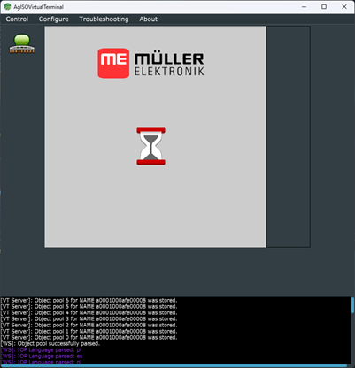
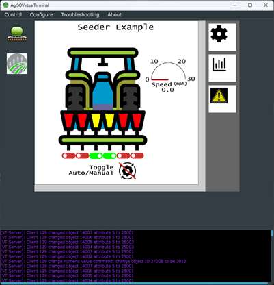

<div align="center">

# AgIsoVirtualTerminal 🚜

— <ins>**Ag**</ins>riculture <ins>**ISO**</ins>-11783 <ins>**Virtual Terminal**</ins>

*The experimental free and open-source ISOBUS virtual terminal for everyone - from hobbyists to industry!*

[Issues & Suggestions](https://github.com/Open-Agriculture/AgIsoVirtualTerminal/issues) | [Discussions](https://github.com/Open-Agriculture/AgIsoVirtualTerminal/discussions) | [Discord](https://discord.gg/uU2XMVUD4b) | [Telegram](https://t.me/+kzd4-9Je5bo1ZDg6)

[](https://github.com/Open-Agriculture/AgIsoVirtualTerminal/commits/main)
[](https://github.com/Open-Agriculture/AgIsoVirtualTerminal/blob/main/LICENSE)

</div>

## About

This project is a multi-platform, experimental ISO11783-6 virtual terminal server GUI meant for agricultural and forestry equipment.

AgIsoVirtualTerminal is designed to serve as the reference/example implementation of the AgIsoStack++ VT server interface.

The project is written in C++, compiled with CMake, and is based on [AgIsoStack++](https://github.com/Open-Agriculture/AgIsoStack-plus-plus) and the [JUCE](https://github.com/juce-framework/JUCE) GUI framework.

This project is in **active development**, and some features may not be completely supported or AEF conformant, but will continue to be improved over time.

We currently support Windows, Linux, and OSX. We may support other platforms in the future.

## Screenshots

 

## Project Status

This section is temporary and will be updated as progress is made on the project.

Supported features:

- All basic ISO11783 functionality, such as address claiming, TP, ETP, diagnostic protocol, etc.
- Object pool deserializer (most objects up to version 6 with some exceptions)
- Data masks
- Alarm masks
- Soft key masks
- Key objects
- Containers
- Object Pointers
- Input numbers
- Input Boolean
- Output numbers
- Output rectangles
- Output ellipse
- Output polygon
- Output line
- Buttons
- Output linear bar graph (except target line)
- Output meter (except tick marks and target line)
- Picture graphics (with and without run-length encoding)
- Output Strings (partial - font clipping is not compliant)
- Input lists
- Most relevant VT server CAN messages
- Logging
- Multiple simultaneous VT clients
- Selecting different working sets
- Most common macro and extended macro functionality

Unimplemented features (for now - we are always adding new features)

- Arbitrary audio control functionality
- Window masks (tolerated in the object pool though)
- Aux N/O (Tolerated in the object pool though)
- Animations
- Output Lists
- Output arched bar graph (Tolerated in the object pool though)
- Graphics contexts
- Pointing events
- TAN
- Several messages, such as ESC
- Open GL mode (currently only software rendering is supported, though JUCE's software rendering is very RAM efficient compared to GL)
- Some way of automatically checking for new releases
- Probably more things to be honest

## Download

If you don't want to compile the software yourself or contribute code to this project, we will post official Windows Installers, OSX .dmg files, and Linux .deb packages on the [releases page](https://github.com/Open-Agriculture/AgIsoVirtualTerminal/releases) which you can use to easily run this software.

Be sure to check back from time to time for new releases!

## Compilation

This project is compiled with CMake and your favorite C++17 compiler.

### Dependencies

Make sure you have `git` installed on your system.
You can follow the instructions [here](https://git-scm.com/book/en/v2/Getting-Started-Installing-Git) to install it. Then, follow the instructions below to install the dependencies for your platform.

Linux:
```
sudo apt update
sudo apt install libasound2-dev libjack-jackd2-dev ladspa-sdk libcurl4-openssl-dev libfreetype6-dev libx11-dev libxcomposite-dev libxcursor-dev libxcursor-dev libxext-dev libxinerama-dev libxrandr-dev libxrender-dev libwebkit2gtk-4.0-dev libglu1-mesa-dev mesa-common-dev cmake pkg-config
```

Fedora:
```
sudo dnf install cmake ninja-build libX11-devel alsa-lib-devel jack-audio-connection-kit-devel freetype-devel mesa-libGL-devel libcurl-devel webkit2gtk4-devel
```

OSX:

If you don't have Brew installed, you'll probably want to install it to make acquiring CMake easier. You can find instructions [here](https://brew.sh/).

```
xcode-select --install
brew install cmake
```

Windows:

On Windows, if you don't have Visual Studio 2022 installed, you will need to download and install the [Build Tools for Visual Studio 2022](https://visualstudio.microsoft.com/downloads/#build-tools-for-visual-studio-2022).

Only 64 bit builds are supported on Windows.

### A note about CMake Versions

CMake 3.22 or higher is required! If the version you have is too old, such as if you are on Ubuntu 18.04 and using the one provided with `apt-get`, you can instead download the latest version of CMake [here](https://cmake.org/download/) and use that to compile this software.

### Building

Generally, to build the project you'll need to clone the repository and run CMake.

```
git clone 
cmake -S. -B build -Wno-dev
cmake --build build
```

### Creating a Windows Installer

This project supports automatic creation of a Windows installer.

Creating a Windows installer requires the nullsoft scriptable install system (NSIS) to be installed on your system. You can download it [here](https://nsis.sourceforge.io/Download).

Using the visual studio developer command prompt or developer powershell, run the following commands from the root of the repository:

```
cmake -S . -B build -Wno-dev
cmake --build build --target package --config Release
```

This will generate a .exe installer in the build directory.

### Creating a Linux .deb package

Creating a .deb package is somewhat easier than creating a Windows installer, but keep in mind that the package will only work on Debian-based systems and only for the same version of each system.
For example, a package created on Ubuntu 20.04 will only work on Ubuntu 20.04 and not on Ubuntu 18.04 or 22.04.

```
cmake -S . -B build -Wno-dev
cd build
cpack -G DEB
sudo dpkg -i AgISOVirtualTerminal-<version>-Linux.deb
```

You can uninstall the package with `sudo apt remove AgISOVirtualTerminal` or `sudo dnf autoremove AgISOVirtualTerminal`.

### Creating an OSX .dmg package

```
cmake -S . -B build -Wno-dev
cmake --build build --target package --config Release
```

## Troubleshooting

* On OSX, if you get an error about `libPCBUSB` when trying to run the program, you'll need to allow the file in System Preferences -> Security & Privacy. This is due to our inclusion of the Mac port of the PCAN driver, and isn't something we can control.
Download the PCAN Library from [mac-can](https://mac-can.com/) and install it as it is written in the README. Then add the Library Path to rpath for the VT-Application on MacOS 15+ 
`install_name_tool -add_rpath /usr/local/lib/ /Applications/AgISOVirtualTerminal.app/Contents/MacOS/AgISOVirtualTerminal`. 
Be shure, to have the correct PCAN Library that matches the Version Number used in AgISOVirtialTerminal. After starting, there is the Error Message that says the libPCBUS is possible a Maleware. Then accept the File in Preferences > Security & Privacy and restart the VT Application.

If you find something that doesn't work, please open an issue on GitHub. Seriously. We want to know about it. Our goal is to make this application completely conformant to the VT standard, so finding issues will help accelerate that process.

If you open an issue, we need the object pool of the working set you were using, plus all logging output from the program to fix it! 

### Disclaimers

Because this software is licensed under the GPL v3.0, you may not include this software in any closed source software, nor link to it in any way from closed source software.

If you wish to sponsor development of this software, please contact us in the discord or telegram channels.

This project is not associated with the Agricultural Industry Electronics Foundation (AEF) in any way. 

This project is not associated with the International Organization for Standardization (ISO) in any way.

Don't ask us to share the ISO standards with you. We can't. You have to buy them from ISO. We don't have the right to share them with you.

By acquiring or using this project you agree to the [JUCE License](https://github.com/juce-framework/JUCE/blob/master/LICENSE.md), [this project's license](https://github.com/Open-Agriculture/AgIsoVirtualTerminal/blob/main/LICENSE), and any applicable licenses provided by dependencies such as AgIsoStack.

This software was not created to compete with any commercial or open-source software. It was created to help hobbyists and professionals alike learn about and experiment with ISOBUS.
