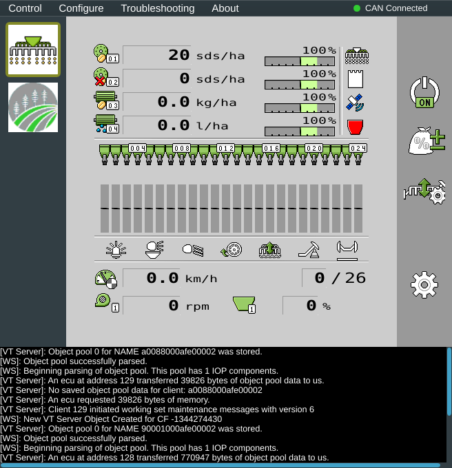
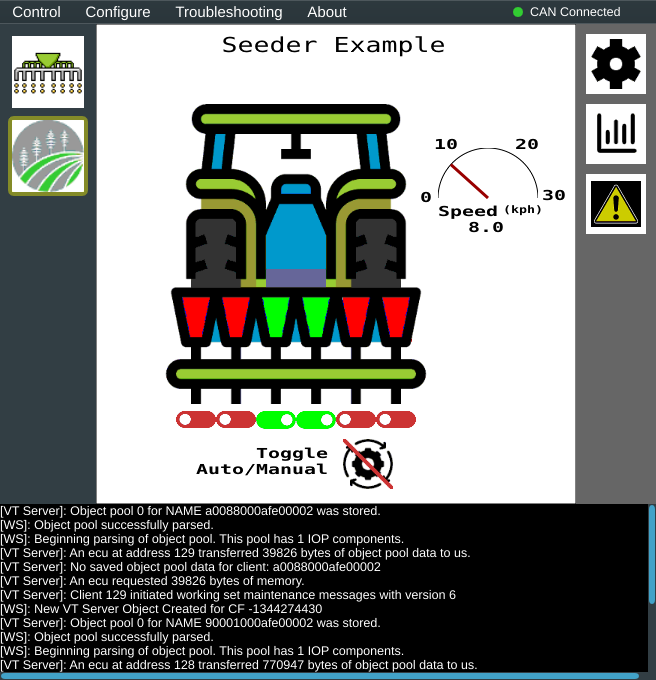

<div align="center">

# AgIsoVirtualTerminal 🚜

— <ins>**Ag**</ins>riculture <ins>**ISO**</ins>-11783 <ins>**Virtual Terminal**</ins>

*The experimental free and open-source ISOBUS virtual terminal for everyone - from hobbyists to industry!*

[Issues & Suggestions](https://github.com/Open-Agriculture/AgIsoVirtualTerminal/issues) | [Discussions](https://github.com/Open-Agriculture/AgIsoVirtualTerminal/discussions) | [Discord](https://discord.gg/uU2XMVUD4b) | [Telegram](https://t.me/+kzd4-9Je5bo1ZDg6)

[](https://github.com/Open-Agriculture/AgIsoVirtualTerminal/commits/main)
[](https://github.com/Open-Agriculture/AgIsoVirtualTerminal/blob/main/LICENSE)

</div>

## About

This project is a multi-platform, experimental ISO11783-6 virtual terminal server GUI meant for agricultural and forestry equipment.

AgIsoVirtualTerminal is designed to serve as the reference/example implementation of the AgIsoStack++ VT server interface.

The project is written in C++, compiled with CMake, and is based on [AgIsoStack++](https://github.com/Open-Agriculture/AgIsoStack-plus-plus) and the [JUCE](https://github.com/juce-framework/JUCE) GUI framework. This project is in **active development**, and some features may not be completely supported or AEF conformant, but will continue to be improved over time.

We currently support Windows, Linux, and macOS. We may support other platforms in the future.

## Screenshots

 

## Project Status

This section is temporary and will be updated as progress is made on the project.

### Supported

- **ISOBUS:** address claiming, TP, ETP, the diagnostic protocol, most relevant VT server CAN messages, and the screen capture command/response
- **Object pools:** most objects up to version 6, except the ones listed under "Not supported yet"
- **Masks:** data masks, alarm masks, and soft key masks
- **Keys and buttons:** key objects and buttons
- **Inputs:** numbers, Booleans, strings, and lists
- **Outputs:** numbers, strings (partial - font clipping is not compliant), linear bar graphs, and meters (bar graphs and meters without tick marks)
- **Graphics:** rectangles, ellipses, polygons, lines, and picture graphics (with and without run-length encoding)
- **Layout:** containers and object pointers
- **Macros:** most common macro and extended macro functionality
- **Working sets:** multiple simultaneous VT clients, and switching between them
- **Application:** logging, and checking GitHub for a newer release on launch (turn it off with "About > Check for Updates on launch", or skip a single version from the update dialog)

### Not supported yet

We are always adding new features.

- **Loaded but not shown:** window masks, Aux N/O, output lists, and output arched bar graphs. A pool that contains them still loads.
- **Not loaded:** animations, graphics contexts, object label reference lists, extended input attributes, external object definitions, external reference NAMEs, external object pointers, colour palettes, graphic data, working set special controls, and scaled graphics. The VT can't load an object pool that contains any of these, so the working set never shows up.
- **Other:** arbitrary audio control, pointing events, TAN, several messages such as ESC, and OpenGL rendering (only software rendering is supported, though JUCE's software rendering is very RAM efficient compared to GL). Probably more things, to be honest.

## Download

If you don't want to compile the software yourself or contribute code to this project, the [releases page](https://github.com/Open-Agriculture/AgIsoVirtualTerminal/releases) has Windows installers, macOS .dmg files, and Ubuntu .deb packages which you can use to easily run this software. Pick the .deb built for your Ubuntu version.

The application checks GitHub for newer releases on launch, so you'll know when there is a new one.

## Getting Started

1. Connect your CAN adapter. Supported adapters are:
   - Windows: PEAK PCAN-USB, InnoMaker USB2CAN, TouCAN, and SysTec
   - Linux: any SocketCAN interface
   - macOS: PEAK PCAN-USB, which needs the PCBUSB library (see [Troubleshooting](#troubleshooting))
2. On Windows, pick your adapter in "Configure > Configure CAN Hardware". On Linux, enter the interface name there instead; it defaults to `can0`. The VT doesn't bring the interface up, so do that first, for example with `sudo ip link set can0 up type can bitrate 250000`. macOS has nothing to configure.
3. Start the VT with "Control > Start/Stop". Tick "Control > Auto-Start VT on launch" to have it start by itself next time.

Each implement shows up in the column on the left once it has uploaded its object pool. If more than one is connected, click one to show it.

### Command line options

- `--vt-number=N` sets which VT this is on the bus, from 1 to 32. Use it to run more than one VT on the same bus.
- `--screen-capture-dir=PATH` sets where screen captures are saved.

### Where files are kept

Settings, logs, and stored object pools are kept in an `Open-Agriculture` folder:

- Windows: `%APPDATA%\Open-Agriculture`
- Linux: `~/.config/Open-Agriculture`
- macOS: `~/Library/Open-Agriculture`

It holds:

- `vt_settings.xml`: your settings
- `AgISOVirtualTerminalLog.txt`: the log
- `CANLog_*.asc`: CAN traffic logs, written only when turned on in "Configure > Logging". Logs older than 3 days are deleted when the VT starts.
- `iso_data/`: the object pools implements stored on the VT, in one folder per implement
- `screen captures/`: screen captures, unless `--screen-capture-dir` says otherwise

## Compilation

This project is compiled with CMake and your favorite C++17 compiler.

### Dependencies

Make sure you have `git` installed on your system.
You can follow the instructions [here](https://git-scm.com/book/en/v2/Getting-Started-Installing-Git) to install it. Then, follow the instructions below to install the dependencies for your platform.

Ubuntu / Debian:
```
sudo apt update
sudo apt install libasound2-dev libjack-jackd2-dev ladspa-sdk libcurl4-openssl-dev libfreetype-dev libfontconfig1-dev libx11-dev libxcomposite-dev libxcursor-dev libxext-dev libxinerama-dev libxrandr-dev libxrender-dev libglu1-mesa-dev mesa-common-dev build-essential cmake pkg-config
```

Fedora:
```
sudo dnf install gcc-c++ make cmake ninja-build libX11-devel libXcomposite-devel libXcursor-devel libXext-devel libXinerama-devel libXrandr-devel libXrender-devel alsa-lib-devel jack-audio-connection-kit-devel freetype-devel fontconfig-devel mesa-libGL-devel libcurl-devel
```

macOS:

If you don't have Brew installed, you'll probably want to install it to make acquiring CMake easier. You can find instructions [here](https://brew.sh/).

```
xcode-select --install
brew install cmake
```

Windows:

On Windows, if you don't have Visual Studio 2022 installed, you will need to download and install the [Build Tools for Visual Studio 2022](https://visualstudio.microsoft.com/downloads/#build-tools-for-visual-studio-2022).

Only 64 bit builds are supported on Windows.

### A note about CMake Versions

CMake 3.22 or higher is required! If the version you have is too old, such as if you are on Ubuntu 20.04 and using the one provided with `apt-get`, you can instead download the latest version of CMake [here](https://cmake.org/download/) and use that to compile this software.

### Building

Generally, to build the project you'll need to clone the repository and run CMake.

```
git clone https://github.com/Open-Agriculture/AgIsoVirtualTerminal.git
cd AgIsoVirtualTerminal
cmake -S . -B build -Wno-dev
cmake --build build
```

The program ends up under `build/AgISOVirtualTerminal_artefacts/`.

### Creating a Windows Installer

This project supports automatic creation of a Windows installer.

Creating a Windows installer requires the nullsoft scriptable install system (NSIS) to be installed on your system. You can download it [here](https://nsis.sourceforge.io/Download).

Using the visual studio developer command prompt or developer powershell, run the following commands from the root of the repository:

```
cmake -S . -B build -Wno-dev
cmake --build build --target package --config Release
```

This will generate a .exe installer in the build directory.

### Creating a Linux .deb package

Creating a .deb package is somewhat easier than creating a Windows installer, but keep in mind that the package will only work on Debian-based systems, and is built for the version you create it on.
For example, a package created on Ubuntu 24.04 may not work on Ubuntu 22.04.

```
cmake -S . -B build -Wno-dev
cmake --build build
cd build
cpack -G DEB
sudo dpkg -i AgISOVirtualTerminal-<version>-Linux.deb
```

You can uninstall the package with `sudo apt remove agisovirtualterminal`.

### Creating a macOS .dmg package

```
cmake -S . -B build -Wno-dev
cmake --build build --target package --config Release
```

## Troubleshooting

* On macOS, the PCAN driver library (`libPCBUSB`) is not included.
Download the PCBUSB library from [mac-can](https://mac-can.com/) and install it as described in its README. Its version has to match the one AgIsoStack++ links against, currently 0.12 (`libPCBUSB.0.12.dylib`). On macOS 15 and newer, also add the library path to the application's rpath:
`install_name_tool -add_rpath /usr/local/lib/ /Applications/AgISOVirtualTerminal.app/Contents/MacOS/AgISOVirtualTerminal`
On the first start, macOS may warn that `libPCBUSB` could be malware. Allow it in System Settings > Privacy & Security, then restart AgIsoVirtualTerminal.

If you find something that doesn't work, please open an issue on GitHub. Seriously. We want to know about it. Our goal is to make this application completely conformant to the VT standard, so finding issues will help accelerate that process.

If you open an issue, we need the object pool of the working set you were using, plus all logging output from the program to fix it! "Troubleshooting > Generate Diagnostic Package" collects the logs, settings, and stored object pools into a .zip file you can attach to the issue.

### Disclaimers

Because this software is licensed under the GPL v3.0, you may not include this software in any closed source software, nor link to it in any way from closed source software.

If you wish to sponsor development of this software, please contact us in the discord or telegram channels.

This project is not associated with the Agricultural Industry Electronics Foundation (AEF) in any way. 

This project is not associated with the International Organization for Standardization (ISO) in any way.

Don't ask us to share the ISO standards with you. We can't. You have to buy them from ISO. We don't have the right to share them with you.

By acquiring or using this project you agree to the [JUCE License](https://github.com/juce-framework/JUCE/blob/master/LICENSE.md), [this project's license](https://github.com/Open-Agriculture/AgIsoVirtualTerminal/blob/main/LICENSE), and any applicable licenses provided by dependencies such as AgIsoStack.

This software was not created to compete with any commercial or open-source software. It was created to help hobbyists and professionals alike learn about and experiment with ISOBUS.
